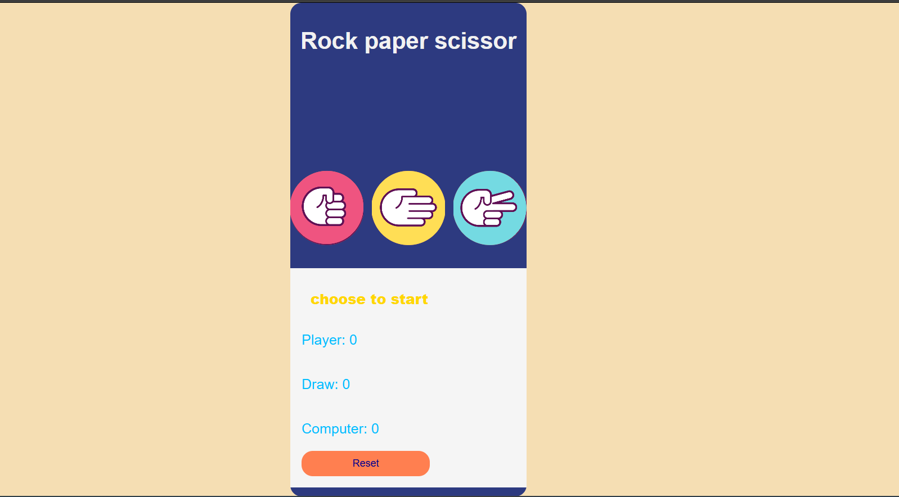

# 🪨📄✂️ Smart Rock Paper Scissors  

A Rock Paper Scissors game with an AI that adapts its choices based on previous moves, rather than picking randomly. Built with JavaScript, HTML, and CSS.  

## 🎮 How to Play  
1. Choose Rock, Paper, or Scissors.  
2. The computer makes its move based on the previous round:  
   - **If it's a draw:** The computer picks randomly.  
   - **If the computer won the last round:** It chooses the option to the right.  
   - **If the computer lost the last round:** It chooses the option to the left.  
3. The game determines the winner using standard rules:  
   - Rock beats Scissors  
   - Scissors beats Paper  
   - Paper beats Rock  

## 🛠️ Technologies Used  
- HTML  
- CSS  
- JavaScript  

## 📷 Screenshots  
Here’s what the game looks like:  

  

## 📏 Features  
✅ Responsive design for different screen sizes  
✅ AI that adapts based on previous rounds  
✅ Engaging UI with smooth interactions  
✅ Score tracking  

## 🔧 Installation  
1. Clone the repository:  
   git clone https://github.com/jibrilMaygag/smart-rock-paper-scissors.git
